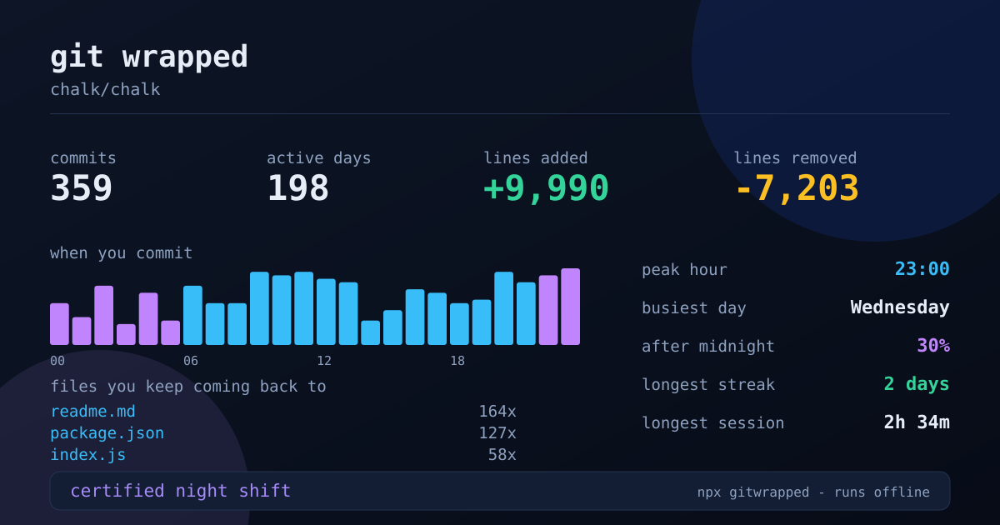

# gitwrapped

[](https://github.com/ProBurakElci/gitwrapped/actions/workflows/ci.yml)
[](LICENSE)

**What your git history says about how you work.** One command, no dependencies, nothing leaves your machine.

```bash
npx gitwrapped
```



*That card is real output from `chalk/chalk` — 30% of its commits land after midnight.*

## What you get

```
  git wrapped  chalk/chalk
  ------------------------------------------------------------
  commits                                                  359
  active days                                     198 of 4,804
  lines added                                           +9,990
  lines removed                                         -7,203
  average commit                                      48 lines

  when you commit
  ▄▄▃▃▆▆▂▂▅▅▃▃▆▆▄▄▄▄██▇▇██▇▇▇▇▃▃▄▄▆▆▅▅▄▄▅▅██▇▇▇▇██
  00                06                12                18

  peak hour                               23:00  6% of commits
  busiest day                                        Wednesday
  after midnight                                           30%
  on weekends                                              29%

  longest streak              2 days  2013-08-03 to 2013-08-04
  longest session                            2h 34m  7 commits

  files you keep coming back to
    readme.md                                             164x
    package.json                                          127x
    index.js                                               58x

  who wrote it
    Sindre Sorhus                                     55%  197
    Josh Junon                                          8%  28

  single-owner files                             43%  33 of 76
  ------------------------------------------------------------
  certified night shift
```

The last line is a verdict, and it is the part people screenshot.

## Usage

```bash
npx gitwrapped                    # this repo, everyone, all time
npx gitwrapped --me               # only your commits
npx gitwrapped --year 2026        # one calendar year
npx gitwrapped --since "3 months ago"
npx gitwrapped --svg card.svg     # also write the shareable 1200x630 card
npx gitwrapped --json             # raw numbers for your own charts
npx gitwrapped ../other-project   # any path
```

Put the card in your own README:

```bash
npx gitwrapped --me --svg docs/gitwrapped.svg
```

## What it measures, and why

| | |
|---|---|
| **peak hour** and the 24-hour histogram | the honest answer to "when do I actually work" — night hours are coloured differently |
| **longest streak** | consecutive calendar days with at least one commit |
| **longest session** | the longest chain of commits less than 90 minutes apart, which is roughly one sitting |
| **files you keep coming back to** | touch counts, not size — the file you edit 164 times is where the friction is |
| **single-owner files** | how much of the repo exactly one person has ever touched, a rough bus factor |
| **average commit size** | lines added plus removed, per commit |
| **after midnight / on weekends** | the two numbers people find most uncomfortable |

Merge commits are excluded: their diffstat double-counts work already attributed to the commits being merged.

## Privacy

Everything is read from the local `.git` folder with a single `git log` call. There is no network code in this package — not for telemetry, not for updates, not for anything. The SVG is written to a path you choose.

## Tests

```bash
node test/run-tests.js
```

53 checks. Most of them feed commit data with a known answer into the statistics and verify the result: streaks that skip a day or cross a year boundary, sessions that break at the 90-minute gap, night-hour and weekend shares, single-owner counting, and the rendering (line widths, escaped text, 24 bars, colour on and off). The last section builds a real git repository with fixed commit dates and runs the CLI against it.

## How it works

```
bin/gitwrapped.js        arguments and output
lib/collect.js           one git log call, parsed into commits
lib/stats.js             the aggregation, including streaks and sessions
lib/render-terminal.js   the card you see in the terminal
lib/render-svg.js        the card you share
```

`collect.js` asks git for a header line per commit plus `--numstat`, using control characters as separators so commit messages cannot break the parse. Everything after that is plain arithmetic over an array of objects — which is why the statistics can be tested without a repository at all.

## Contributing

New statistics are welcome. Add the calculation to `analyze()` in `lib/stats.js`, a line to the terminal card, and a test with a hand-built history whose answer you know. If the statistic says something about a person rather than about the codebase, it belongs here.

## License

MIT — see [LICENSE](LICENSE).
